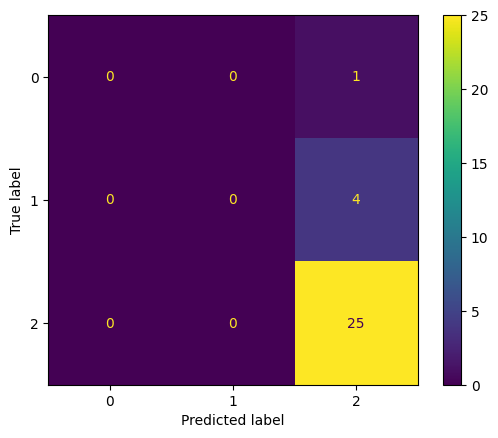
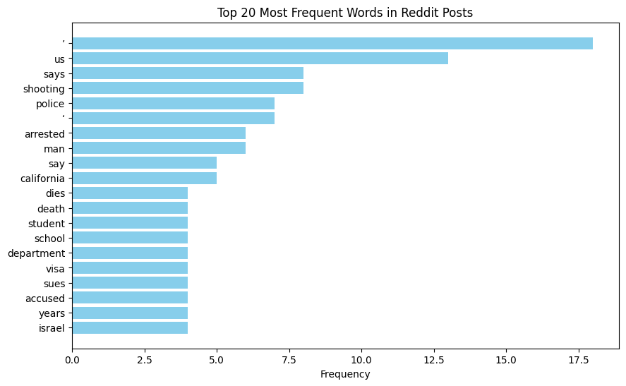
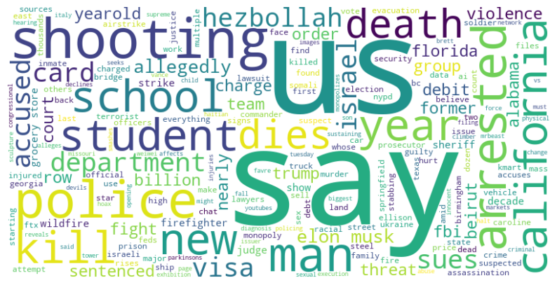

# 🚨 Reddit Misinformation Analysis 🛑

## 📋 Overview

This project analyzes Reddit posts to detect **misinformation**, **hate speech**, and **neutral content** using text analysis and machine learning techniques. The workflow includes:

- Data extraction
- Preprocessing
- Exploratory data analysis (EDA)
- Text analysis (NLP)
- Manual labeling
- Classification model training

---

## 📁 Project Structure

1. **`0_reddit_data_extractor.py`**
   - Extract Reddit posts using the PRAW API and save to CSV.
2. **`1_data_preprocessing.py`**
   - Clean text data by removing URLs, punctuation, and stopwords.
3. **`2_eda.py`**
   - Perform EDA including word frequency visualization and word cloud generation.
4. **`3_text_analysis.py`**
   - Conduct sentiment analysis, topic modeling (LDA), and keyword extraction.
5. **`4_manual_labeling.py`**
   - Manually label posts as "misinformation", "hate speech", or "neutral".
6. **`5_classification_model.py`**
   - Train a Naive Bayes classifier to predict Reddit post categories.

---

## 📦 Prerequisites

**Python 3.x** is required. Install dependencies:

```bash
pip install pandas numpy nltk gensim scikit-learn matplotlib wordcloud
```

---

## 💻 How to Run the Project

### 1. **Data Extraction (`0_reddit_data_extractor.py`)**
- Extract Reddit posts from a subreddit.
- **Command:** `python 0_reddit_data_extractor.py`
- **Output:** `reddit_posts.csv`

### 2. **Data Preprocessing (`1_data_preprocessing.py`)**
- Clean and preprocess text data.
- **Command:** `python 1_data_preprocessing.py`
- **Output:** `cleaned_reddit_posts.csv`

### 3. **Exploratory Data Analysis (EDA) (`2_eda.py`)**
- Visualize word frequencies and generate word clouds.
- **Command:** `python 2_eda.py`
- **Output:** Visualizations saved in `plots/`.

### 4. **Text Analysis using NLP (`3_text_analysis.py`)**
- Perform sentiment analysis, keyword extraction, and topic modeling.
- **Command:** `python 3_text_analysis.py`

### 5. **Manual Labeling (`4_manual_labeling.py`)**
- Assign labels to posts (misinformation, hate speech, neutral).
- **Command:** `python 4_manual_labeling.py`
- **Output:** `labeled_reddit_posts.csv`

### 6. **Classification Model (`5_classification_model.py`)**
- Train a Naive Bayes classifier and evaluate model performance.
- **Command:** `python 5_classification_model.py`
- **Output:** Classification metrics (accuracy, precision, recall, F1-score).

---

## 🌟 Key Features

- **Text Cleaning**: Removes URLs, punctuation, stopwords.
- **Sentiment Analysis**: Analyzes sentiment using VADER.
- **Topic Modeling**: Uses LDA for topic discovery.
- **Keyword Extraction**: Extracts important keywords with TF-IDF.
- **Manual Labeling**: Auto-labels posts based on keywords.
- **Classification Model**: Trains a Naive Bayes classifier.

---
## 📊 Final Results

### 1. **Evaluation Metrics**

The model was trained using a Naive Bayes classifier and evaluated using accuracy, precision, recall, and F1-score metrics.

- **Accuracy**: 83.33%
- **Precision**: 86.11%
- **Recall**: 83.33%
- **F1 Score**: 75.76%

You can find the detailed classification report and evaluation metrics in the results folder:
- [Classification Report](results/classification_report.txt)
- [Evaluation Metrics](results/evaluation_metrics.txt)

### 2. **Confusion Matrix**

The confusion matrix visualizes the classification performance of the model:



### 3. **Word Frequency Analysis**

We performed exploratory data analysis to identify the most common words used in the dataset. Below is a bar chart showing the top 20 most frequent words:



Additionally, here is a word cloud that visualizes the most frequent words:



## 🔧 Future Improvements

- **Advanced Models**: Try Logistic Regression, Random Forest, or deep learning models.
- **Improved Labeling**: Use larger datasets or a better labeling system.
- **Real-time Data**: Integrate real-time Reddit post monitoring.

---

## 📜 License

This project is licensed under the **MIT License**. See the LICENSE file for details.

---

## ✉️ Contact

For any questions or inquiries, contact the project maintainer at [dhanyapriyas@arizona.edu](mailto:dhanyapriyas@arizona.edu).
